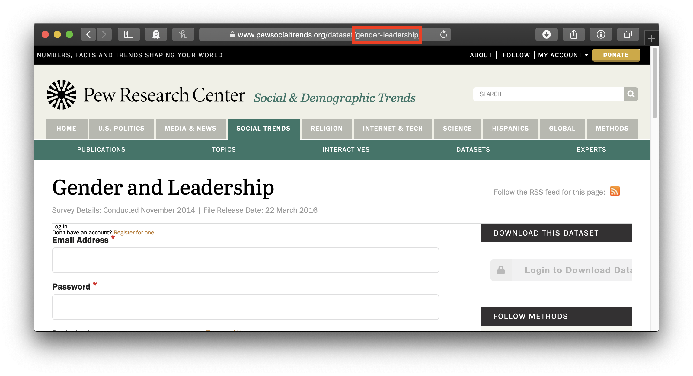
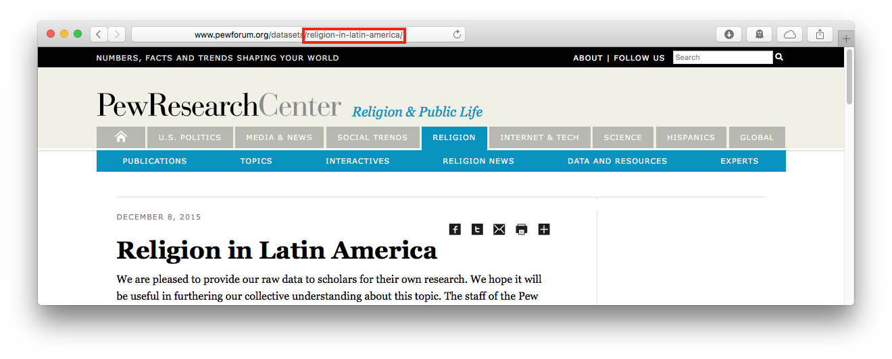

The [Pew Research Center](http://www.pewresearch.org), in its [own words](http://www.pewresearch.org/about/), "is a nonpartisan fact tank that informs the public about the issues, attitudes[,] and trends shaping America and the world."  As a result, Pew is an invaluable source of survey data on a wide range of topics; the surveys it conducts are available on its website, generally after an embargo of about six months.  Researchers taking advantage of these datasets, however, are caught in a bind.  The terms and conditions for downloading any Pew dataset state that one "may not reproduce, sell, rent, lease, loan, distribute or sublicense or otherwise transfer any Data, in whole or in part, to any other party."^[The terms _do_ include an exception that one "may incorporate limited portions of the Data in scholarly, research or academic publications or for the purposes of news reporting" with attribution, but this would appear inadequate for the purposes of reproducibility.] But to ensure that one's work can be reproduced, assessed, and built upon by others, one must provide access to the raw data one employed.  The `pewdata` package cuts this knot by providing programmatic, reproducible access to Pew's datasets from within R. 

## Setup

When used interactively, the `pew_download` function will ask for the login information required by the Roper Center: the registered user’s email and password. 
After that information is input once, it will be entered automatically for any other download requests made in the same session.

To change this contact information within a session, one may set the argument `reset` to `TRUE` when running `pew_download` again, and the function will again request the required information. 

An optional, but highly recommended, setup step is to add the contact information Pew requires to your [.Rprofile](http://www.statmethods.net/interface/customizing.html) as in the following example:

```{r eval = FALSE}
options("pew_email" = "jherrera@uppermidwest.edu",
        "pew_password" = "password123!")
```

The `pew_download` function will then have access the information it needs to pass on to Pew by default.  This means that researchers will not have to expose their info in their R scripts and that others reproducing their results later will be able to execute those R scripts without modification.  (They will, however, need to enter their own information into their own .Rprofiles, a detail that should be noted in the reproducibility materials to avoid confusion.)


## Use

The `pew_download` function (1) opens a Chrome browser and navigates to the website of the specified Pew Research Center research area, (2) enters the required information to log in, (3) navigates to a specified dataset, (4) downloads the dataset's files, and, optionally but by default, (5) decompresses the dataset's files to a subdirectory within a specified directory (or, by default, a `pew_data` directory in the current working directory).

Datasets are specified using the `file_id` and `area` arguments.  The `area` argument indicates which of the seven Pew research areas produced the dataset:

| | |
|-|-|
|`"politics"` | U.S. Politics & Policy (the default)
|`"journalism"` | Journalism & Media
|`"internet"` | Internet, Science & Tech
|`"religion"` | Religion & Public Life
|`"hispanic"` | Hispanic Trends
|`"global"` | Global Attitudes & Trends
|`"socialtrends"` | Social & Demographic Trends

The `file_id` argument specifies particular datasets within the `area`.  Pew does identifies datasets as strings across all of its research areas, but the only way to get the id for a dataset is to copy it from the end of the dataset's url.  For the November 2014 Gender and Leadership survey conducted by Pew Social & Demographic Trends, for example, the file id is "gender-leadership":



To reproducibly download this dataset:

```{r eval=FALSE}
pew_download(area = "socialtrends", file_id = "gender-leadership")
```

For the Pew Forum on Religion & Public Life's dataset Religion in Latin America, the file id is "religion-in-latin-america":



To download this dataset reproducibly:

```{r eval=FALSE}
pew_download(area = "religion", file_id = "religion-in-latin-america")
```

Multiple datasets may be downloaded from the same research area in a single command by passing a vector of ids to `file_id`.  The following downloads the September 2018 Political Survey; the July 11-15, 2018 Weekly Survey; and the June 2018 Political Survey from the U.S. Politics & Policy area (which is the default for `area`):

```{r eval=FALSE}
pew_download(file_id = c("september-2018-political-survey", "july-11-15-2018-weekly-survey", "june-2018-political-survey"))
```

After the needed datasets are downloaded, they are, by default, unzipped, and the data file is converted to .RData format and renamed with the file id.^[In the event that the download contains more than one data file, all are converted to .RData format, but only the largest of the original files is renamed.]  The original files are left unmodified.
