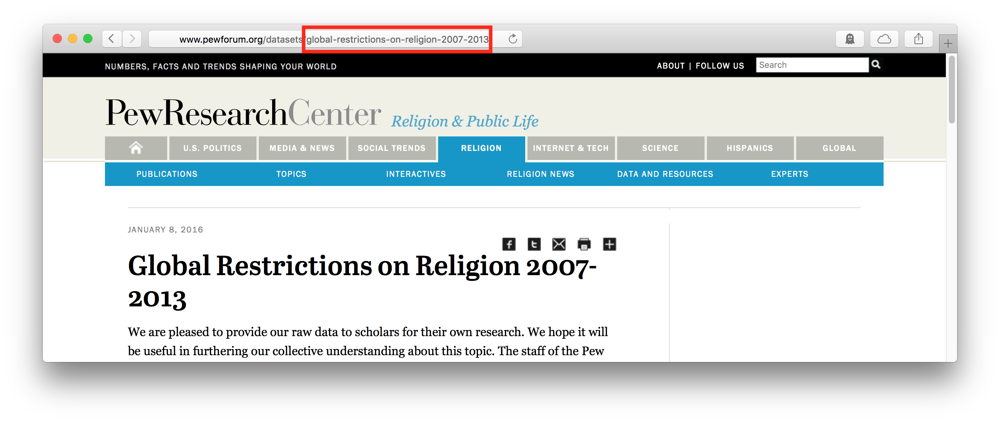

The [Pew Research Center](http://www.pewresearch.org), in its [own words](http://www.pewresearch.org/about/), "is a nonpartisan fact tank that informs the public about the issues, attitudes[,] and trends shaping America and the world."  As a result, Pew is an invaluable source of survey data on a wide range of topics; the surveys it conducts are available on its website, generally after an embargo of about six months.  Researchers taking advantage of these datasets, however, are caught in a bind.  The terms and conditions for downloading any Pew dataset state that one "may not reproduce, sell, rent, lease, loan, distribute or sublicense or otherwise transfer any Data, in whole or in part, to any other party."[^1] But to ensure that one's work can be reproduced, assessed, and built upon by others, one must provide access to the raw data one employed.  The `pewdata` package cuts this knot by providing programmatic, reproducible access to Pew's datasets from within R. 

## Setup

`pewdata` depends on the Firefox browser; if it is not installed, [get it here](https://www.mozilla.org/firefox).

An optional, but recommended, setup step is to add the contact information Pew requires to your [.Rprofile](http://www.statmethods.net/interface/customizing.html) as in the following example:

```{r eval = FALSE}
options("pew_name" = "Juanita Herrera",
        "pew_org" = "Upper Midwest University",
        "pew_phone" = "888-000-0000",
        "pew_email" = "jherrera@uppermidwest.edu")
```

The `pew_download` function will then have access the information it needs to pass on to Pew by default.  This means that researchers will not have to expose their info in their R scripts and that others reproducing their results later will be able to execute those R scripts without modification.  (They will, however, need to enter their own information into their own .Rprofiles, a detail that should be noted in the reproducibility materials to avoid confusion.)


## Use

The `pew_download` function (1) opens a Firefox browser pointed to a specified dataset, (2) enters the required contact information and agrees to the terms and conditions of the download, (3) downloads the dataset's files, and, optionally but by default, (4) decompresses the dataset's files to a subdirectory within a specified directory (or, by default, a `pew_data` directory in the current working directory).

Datasets are specified using the `file_id` and `area` arguments.  The `area` argument indicates which of the seven Pew research areas produced the dataset:

| | |
|-|-|
|`"politics"` | U.S. Politics & Policy (the default)
|`"journalism"` | Journalism & Media
|`"internet"` | Internet, Science & Tech
|`"religion"` | Religion & Public Life
|`"hispanic"` | Hispanic Trends
|`"global"` | Global Attitudes & Trends
|`"socialtrends"` | Social & Demographic Trends

The `file_id` argument specifies particular datasets within the `area`.  Unfortunately, Pew does not identify datasets in a uniform manner across all of its research areas (`"journalism"`, `"internet"`, and `"religion"` use strings; the rest use numeric ids), and the only way to get the id for a dataset is to copy it from the end of the dataset's url.  For the November 2014 Gender and Leadership survey conducted by Pew Social & Democraphic Trends, for example, the file id is 21476:


To reproducibly download this dataset:

```{r eval=FALSE}
pew_download(area = "socialtrends", file_id = 21476)
```

For the Pew Forum on Religion & Public Life's dataset Global Restrictions on Religion 2007-2013, the file id is "global-restrictions-on-religion-2007-2013":



To download this dataset reproducibly:

```{r eval=FALSE}
pew_download(area = "religion", file_id = "global-restrictions-on-religion-2007-2013")
```

Multiple datasets may be downloaded from the same research area in a single command by passing a vector of ids to `file_id`.  The following downloads the Weekly Survey of September 3-7, 2015; the July 2015 Political Survey; and the May 2015 Political Survey from the U.S. Politics & Policy area (which is the default for `area`):

```{r eval=FALSE}
pew_download(file_id = c(20059613, 20059299, 20058139))
```

After the needed datasets are downloaded, they are, by default, unzipped and ready to be loaded into R using, e.g., `haven::read_sav` or `rio::import`.

[^1]: The terms _do_ include an exception that one "may incorporate limited portions of the Data in scholarly, research or academic publications or for the purposes of news reporting" with attribution, but this would appear inadequate for the purposes of reproducibility.
